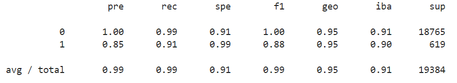
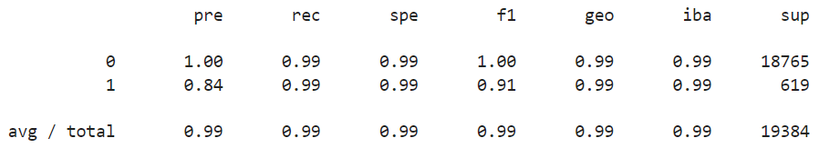

# Module12Challenge
Supervised Learning

## Technologies

This project leverages jupyterlab version 3.2.1.

## Usage

Ensure the conda dev environment is activated.

Using CLI, please launch the jupyter lab. Please open the credit_risk_resampling.ipynb. Restart the kernel.

## Overview of the Analysis

We were tasked to use a dataset of historical lending activity from a peer-to-peer services company to build a model that can identify the creditworthiness of borrowers. We used the logistic regression type of classifier that will be to categorize the riskiness of the loans in the into “healthy loan” and “high-risk loan” labels. We performed the analysis in following three steps:   

#### 1) Split the Data into Training and Testing Sets

The lending data file (lending_data.csv in the Resources folder) consists of the following columns: loan_size, interest_rate, borrower_income, debt_to_income, num_of_accounts, derogatory_marks, total_debt and loan_status. To prepare data, column 'loan status' was assigned as y (target) varaible and and all other remaining columns (features) are assigned as X variable. A value of 0 in the “loan_status” column means that the loan is healthy. A value of 1 means that the loan has a high risk of defaulting. 

The value_counts at this stage is 75036 healthy loans ('0') and 2500 high risk loans ('1').

Next, use the train_test_split function from the scikit-learn library to automatically split our data into training and testing data. The following value_counts exist after the split:

Train Set: 56271 healthy loans and 1881 high risk loans

Test Set:  18765 healthy loans and 619 high risk loans

#### 2) Create a Logistic Regression Model with the Original Data

We used the train data to fit a logistic regression model and the save the predictions on the testing data labels by using the testing feature data (X_test) and the fitted model. A confusion matrix and classification report were generated. Please refer to the Results section for classification report.

#### 3) Predict a Logistic Regression Model with Resampled Training Data

Out of total 77,536 (75036 + 2500) loans only 2500 are high-risk loans. Hence the data on the home loans is imbalanced. This suggests that a model that uses resampled data will perform better. Hence there is a need to resample the training data and then reevaluate the model.

We used the RandomOverSampler function (from library named imbalanced-learn, or imblearn) to oversample the data. This library of tools can help us fix imbalanced classes. The value_counts of the resampled labels is as follows:

y_resampled data: 56271 healthy loans and 56271 high risk loans

We used the LogisticRegression classifier and the resampled data to fit the model and make predictions. A confusion matrix and classification report were generated. Please refer to the Results section for classification report.

## Results

### Classification Report - Original Data

- balanced accuracy score - 0.9520 (95.20 %)
- precision score (avg) - 0.99 (99 %)
- recall score (avg) - 0.99 (91 %)

### Classification Report - Resampled Data

- balanced accuracy score - 0.9936 (99.36 %)
- precision score (avg) - 0.99 (99 %)
- recall score (avg) - 0.99 (99 %)

## Summary

Based on the classification report (for original data) above the recall (value=0.99) for the '0' class (healthy loan) is much better than that (value=0.91) for the '1' class (high-risk loan). The precision for the 0 values is 1.0. This means that out of all the times that the model predicted the testing data observation to be the value 0, almost 100% of those predictions were correct. By contrast, out of all the times the model predicted a value of 1, 85% of those predictions were correct. 

Based on the classification report (for resampled data) above the recall (value=0.99) for the '0' class (healthy loan) is similar to (value=0.99) the '1' class (high-risk loan). The precision for the 0 values is 1.0. This means that out of all the times that the model predicted the testing data observation to be the value 0, almost 100% of those predictions were correct. By contrast, out of all the times the model predicted a value of 1, 84% of those predictions were correct. 

Hence we can infer that oversampling the data is artifically increasing the number of instances in the minority class. In this case, it increases the frequency of the 1 values or the high-risk loans. That trains the model to tend to correctly predict all the true 1 values (to have a higher recall) or high-risk laons. But, this happens at the expense of tending to overestimate the frequency of the 1 values (to have a slightly lower (0.84 vs 0.85) precision). The slight decrease in precision at the cost of identifying the high-risk is acceptable. Therefore, Logistic Regrssion Model with resampled train data is a better model to apply to future data points.
